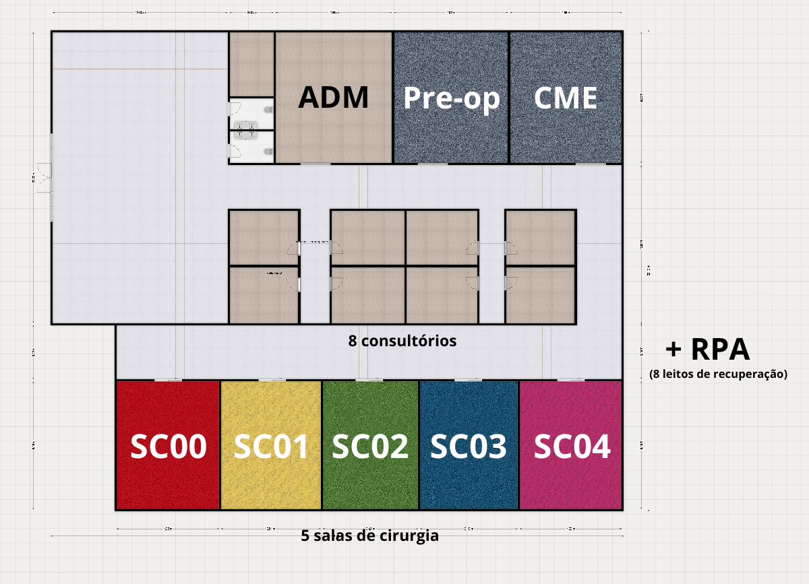
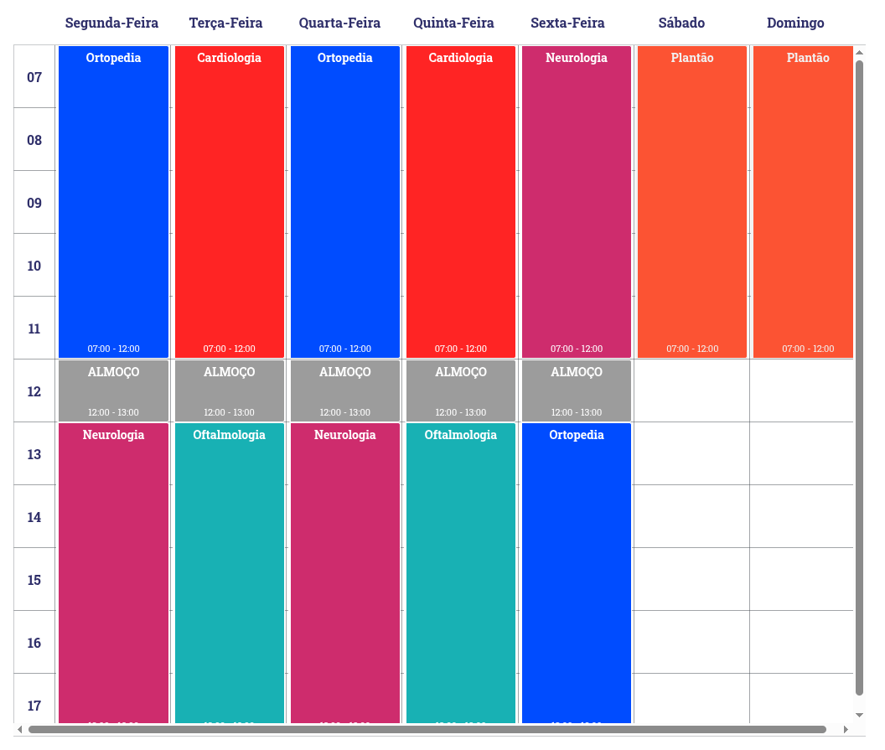
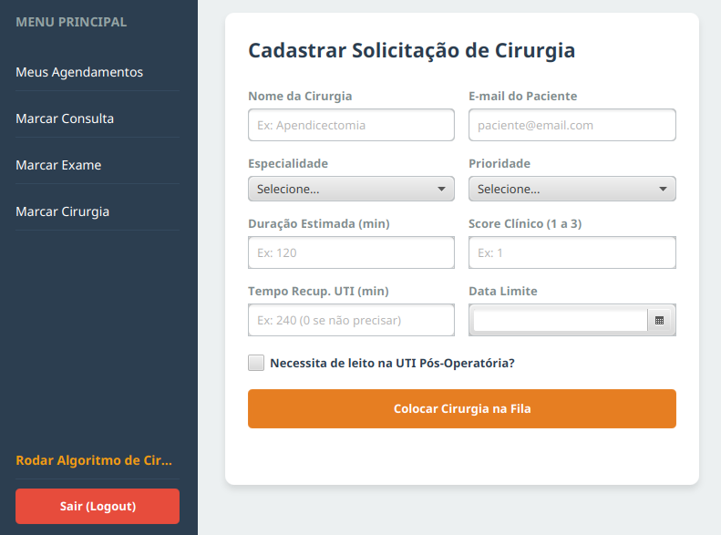
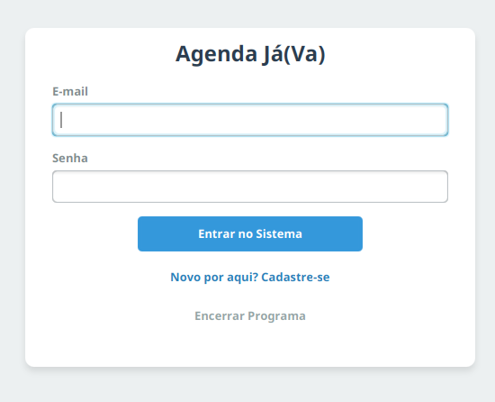
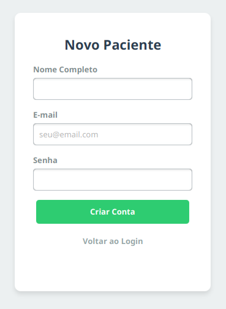
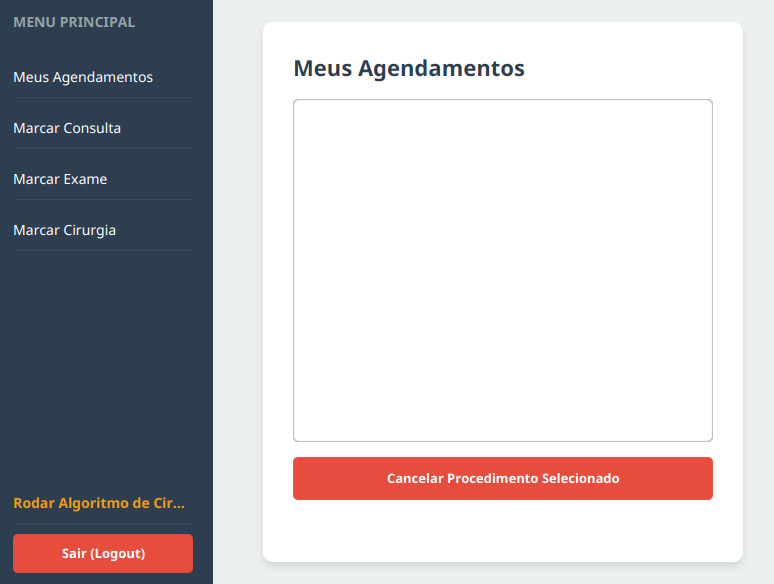
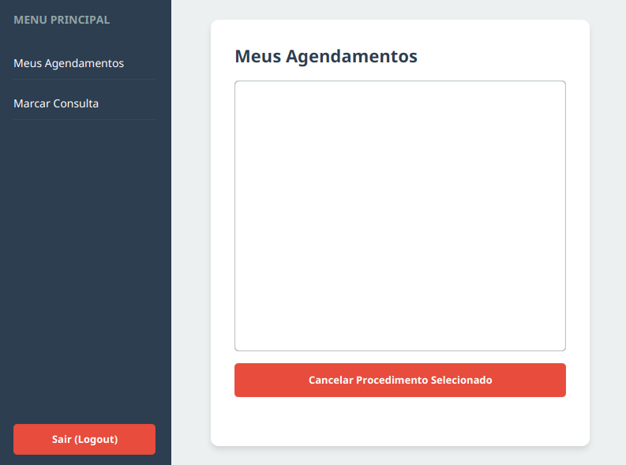
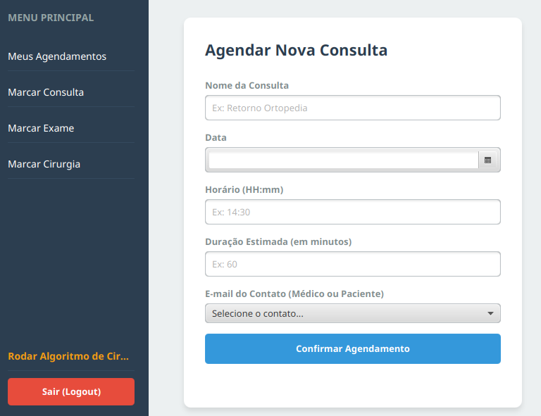
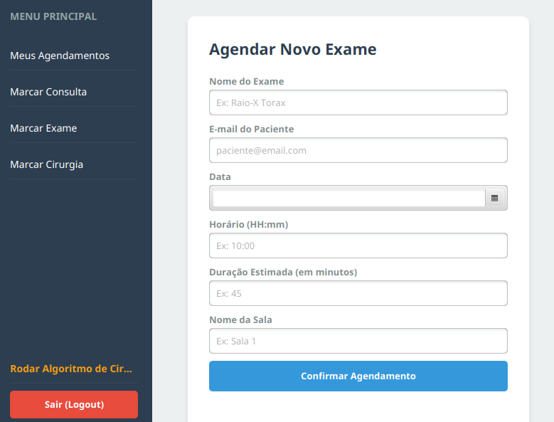

# 🏥 Agenda Já(Va) - Sistema de Gestão Clínica


O **Agenda Já(Va)** é um sistema desktop robusto desenvolvido em Java e JavaFX para a gestão automatizada de clínicas médicas. O projeto organiza o fluxo de pacientes, médicos e salas, possuindo como grande diferencial um **Motor de Agendamento Cirúrgico** que aloca cirurgias automaticamente com base em prioridade clínica e disponibilidade de recursos.

---

## 📑 Índice
1. [Sobre o Projeto](#-sobre-o-projeto)
2. [Funcionalidades Principais](#-funcionalidades-principais)
3. [O Algoritmo de Cirurgias](#-o-algoritmo-de-cirurgias)
4. [Regras de Permissão](#-regras-de-permissão)
5. [Telas do Sistema](#-telas-do-sistema)
6. [Arquitetura e Banco de Dados](#-arquitetura-e-banco-de-dados)
7. [Como Executar](#-como-executar)

---

## 💡 Sobre o Projeto

O objetivo do software é espelhar a realidade de uma clínica médica com **8 consultórios** e **5 salas de cirurgia**. O sistema evita conflitos de horários e elimina a necessidade de gestão manual de recursos complexos, garantindo que procedimentos só sejam confirmados se todos os requisitos (médico, sala, UTI) estiverem satisfeitos.

#### Mapa da clínica:


#### Escala dos consultórios:


---

## 🚀 Funcionalidades Principais

* **Autenticação Segura:** Login dinâmico que identifica se o usuário é Paciente ou Médico.
* **Cadastro de Usuários:** Interface dedicada para registro de novos pacientes no banco de dados.
* **Dashboard Inteligente:** A interface se adapta ao tipo de usuário logado, ocultando funções não autorizadas (ex: pacientes não veem o botão de agendar cirurgias).
* **Gestão de Consultas e Exames:**
  * Dropdowns inteligentes que listam apenas E-mails válidos de contatos (Médicos veem pacientes; Pacientes veem médicos).
  * Tratamento de sobreposição de horários.
* **Cancelamento de Procedimentos:** Remoção dinâmica de procedimentos das agendas de todos os envolvidos (Médico, Paciente e Sala) e exclusão definitiva do banco de dados.

---

## ⚙️ O Algoritmo de Cirurgias

O agendamento de cirurgias não é manual. O médico cadastra a *Solicitação de Cirurgia* em uma Fila de Prioridades. Ao acionar o **Motor de Agendamento**, o sistema executa os seguintes cálculos:

1. **Classificação de Prioridade:** Ordena a fila considerando casos de Emergência, Urgência (com Data Limite) e Eletivas (com Score Clínico de 1 a 3).
2. **Alocação de Equipe:** Busca no sistema um Cirurgião da especialidade requerida e um Anestesista (do pool global) disponíveis simultaneamente.
3. **Reserva de Espaço:** Encontra uma Sala de Cirurgia livre pelo tempo estimado do procedimento + 30 minutos de limpeza (*turnover*).
4. **Gestão de UTI:** Caso a cirurgia exija UTI no pós-operatório, o algoritmo verifica a disponibilidade dos leitos de RPA antes de confirmar a cirurgia.

#### Tela de cadastro de solicitação de cirurgia:


---

## 🔒 Regras de Permissão

Para garantir a integridade dos dados, o sistema impõe restrições estritas de acesso:

| Ação no Sistema | Pacientes | Médicos |
| :--- | :---: | :---: |
| **Acessar "Meus Agendamentos"** | ✅ | ✅ |
| **Cancelar Procedimento Próprio**| ✅ | ✅ |
| **Agendar Consulta** | ✅ | ✅ |
| **Agendar Exame** | ❌ | ✅ |
| **Solicitar Cirurgia** | ❌ | ✅ |
| **Processar Fila de Cirurgias** | ❌ | ✅ |

---

## 🖼️ Telas do Sistema

### 1. Tela de Login e Cadastro
Interface limpa para acesso ao sistema. O botão "Novo por aqui?" direciona para o formulário de cadastro de pacientes.

#### Login:


#### Cadastro:


### 2. Dashboard Dinâmico
Painel principal que exibe as opções permitidas no menu lateral.

#### Médicos:


#### Pacientes:


### 3. Formulário de Consultas/Exames
Interface com uso de `DatePicker` e `ComboBox` dinâmico para seleção anti-erros de médicos ou pacientes.

#### Agendar Consulta:


#### Agendar Exame:


### 4. Gerenciamento de Agendamentos
Listagem (ListView) de todos os procedimentos atrelados ao usuário logado, com botão funcional de cancelamento.

#### Listagem de Procedimentos:


---

## 📁 Arquitetura e Banco de Dados

O sistema utiliza arquivos `.json` locais como banco de dados NoSQL, garantindo a persistência total das informações entre as sessões. A biblioteca **Jackson** é utilizada para a serialização e desserialização polimórfica dos objetos.

* `users.json`: Armazena Pacientes e Médicos (com suas respectivas especialidades e flags de cirurgião/anestesista).
* `rooms.json`: Armazena as salas físicas da clínica (Consultórios).
* `procedures.json`: Guarda Consultas, Exames e Cirurgias confirmadas. Possui tratamento anti-loop e construtores `@JsonCreator` isolados para reconstrução fiel das agendas em memória (Prevenção de Amnésia).

---

## 💻 Como Executar

### Pré-requisitos
* **Java JDK 21** ou superior configurado nas variáveis de ambiente.
* Conexão com a internet para o download das dependências do Gradle.

Para executar, basta escrever no terminal:
#### No Linux/MacOS

   ```bash
   ./gradlew run
   ```

#### No Windows

   ```bash
   .\gradlew.bat build
   ```

## Membros do Grupo
- Isabella Favaron Rover (RA: 281248)
- Manuela Daros Misurelli (RA: 278223)
- Tereza Figueiredo Diniz Zeni (RA: 278914)
- Vinícius Cappelli d'Avila (RA: 185507)